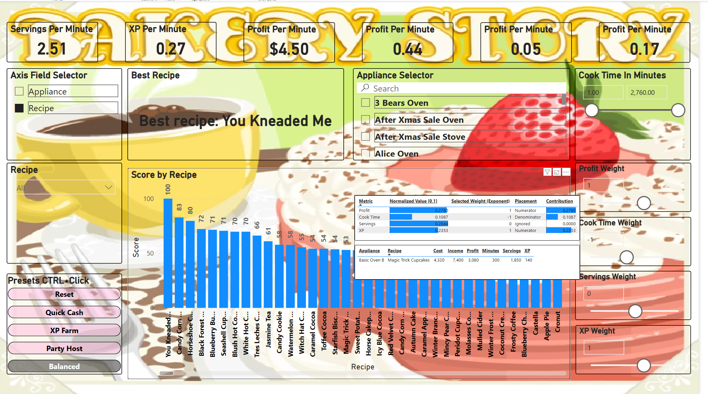

# 🍰 Bakery Story: Recipe Efficiency Report (Power BI)

A Power BI report that ranks *Bakery Story* recipes based on what *you* value—Profit, Cook Time, Servings, and XP. Use dynamic sliders and an exponent-based scoring model built on ratio-normalized metrics to customize the rankings in real time.

---

## What’s the Game?

*Bakery Story* is a mobile sim where you run a bakery—cooking, serving, earning coins, and leveling up. Recipes vary in cook time, servings, profit, and XP. Appliances are limited, and customers arrive steadily.

Which recipe is *best*? That depends on your goals.

---

## Why I Made This

A debate with my partner, Stephanie—she liked low-maintenance bakes; I wanted fast profits. This report lets you decide what matters and adapts accordingly.

---

## What It Does

Ranks recipes based on your priorities with instant updates.

**Features:**
- Sliders for Profit, Cook Time, Servings, XP  
- Preset strategies (*Quick Cash*, *XP Farm*, etc.)  
- Appliance filters, cook-time caps  
- Context-aware DAX logic and transparent scoring  
- Tooltips, bookmarks, and exportable measures

---

## How It Works

A responsive scoring model using:

- **Ratio-normalized metrics** (shifted to [1–2])  
- **Exponent weighting** for nonlinear influence  
- **Dynamic DAX** that adapts to filters and slicers

---

## Scoring Logic

1. Normalize each metric to [1–2]  
2. Apply user-defined exponents  
3. Multiply preferred metrics, divide by penalized  
4. Rank by resulting score in current context

📄 [See Measures Overview](./docs/measures_overview.md)  
📥 [Download DAX Measures (.xlsx)](https://raw.githubusercontent.com/Nicholas-BI/bakery-efficiency-score/main/docs/files/dax_measures.xlsx)

---

## Preset Strategies

Click through these preset bookmarks to quickly switch between strategy profiles.

| Strategy     | Profit | Cook Time | Servings | XP | Description                    |
|--------------|--------|-----------|----------|----|--------------------------------|
| Quick Cash   | 20     | -20       | –5       | 1  | Maximize profit, minimize time |
| XP Farm      | 5      | –20       | –5       | 20 | Fast XP with short bakes       |
| Party Host   | 1      |   0       | 20       | 1  | Max servings for events        |
| Balanced     | 2      | –1        | -1       | 2  | Well-rounded optimization      |

---

## Data Model

Follows a clean star schema for optimal performance.

**Fact Table:**  
- `Fact_Bakery` — Core metrics

**Dimensions:**  
- `Dim_Recipe`, `Dim_Appliance`

**Weight Tables (disconnected):**  
- `ProfitWeight`, `CookTimeWeight`, `ServingsWeight`, `XPWeight`

**Helpers:**  
- `Metrics`, `Axis Field Selector`, `Measure Table`

📄 [Data Model Overview](./docs/data_model_overview.md)

---

## Power Query

Modular ETL in Power Query:

- Source → Base → Output  
- Clear step names, reusable logic

📄 [Power Query Overview](./docs/power_query_overview.md)

---

## Report Design

- One-page layout with slicers & bookmarks  
- Tooltips for full score logic  
- Game-inspired theming

📄 [Visuals Overview](./docs/visuals_overview.md)

---

## 📥 Try It

- [Download .pbix](https://raw.githubusercontent.com/Nicholas-BI/bakery-efficiency-score/main/docs/bakery_story.pbix)  
- [Download DAX Measures](https://raw.githubusercontent.com/Nicholas-BI/bakery-efficiency-score/main/docs/dax_measures.xlsx)  
- [Download Source Data](https://raw.githubusercontent.com/Nicholas-BI/bakery-efficiency-score/main/docs/bakery_story_source.xlsx)

Open the `.pbix` in [Power BI Desktop](https://powerbi.microsoft.com/desktop), adjust sliders, and watch the rankings shift.

---

## ▶️ Get Started

1. Clone:  
   `git clone https://github.com/Nicholas-BI/bakery-efficiency-score.git`  
2. Open `bakery_story.pbix`  
3. Tweak sliders and explore strategies  
4. Review tooltips and scoring logic

---

## 📁 Repo Contents

- [`docs/files/bakery_story.pbix`](./docs/files/bakery_story.pbix) — Main Power BI report  
- [`docs/files/dax_measures.xlsx`](./docs/files/dax_measures.xlsx) — All DAX formulas  
- [`docs/files/bakery_story_source.xlsx`](./docs/files/bakery_story_source.xlsx) — Sample source data  

### 📄 Documentation
- [`docs/measures_overview.md`](./docs/measures_overview.md) — DAX logic breakdown  
- [`docs/data_model_overview.md`](./docs/data_model_overview.md) — Table structure and relationships  
- [`docs/power_query_overview.md`](./docs/power_query_overview.md) — ETL / M code design  
- [`docs/visuals_overview.md`](./docs/visuals_overview.md) — Report pages and interaction patterns  

- [`LICENSE`](./LICENSE) — CC BY-NC 4.0

---

## Screenshots

| Ranked Recipes | Control Panel |
|----------------|----------------|
| *(Image placeholder)* | *(Image placeholder)* |

---

## Contributing

Ideas or feedback? Open an issue or submit a PR.

---

## License

[Creative Commons BY-NC 4.0](./LICENSE)  
Free to use, remix, and share for non-commercial use with credit.
