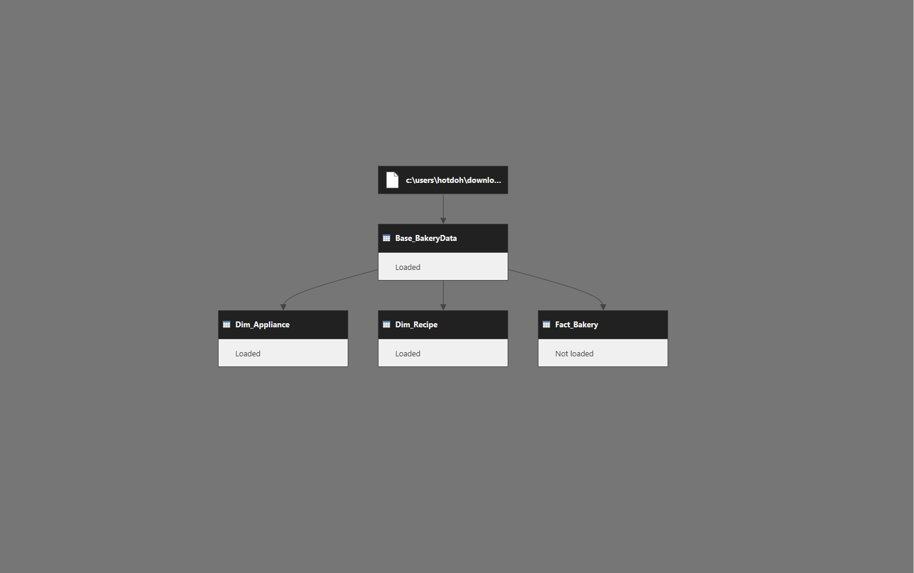

# 🍰 Bakery Story: Recipe Efficiency Score (Power BI)

A Power BI report that helps you find the best recipes in *Bakery Story* based on what *you* care about. Customize real-time rankings with interactive sliders and a nonlinear scoring model built on ratio-normalized metrics.

---

## What’s the Game?

In *Bakery Story*, you’re running a virtual bakery focused on cooking, serving, leveling up, and trying to make the most of limited appliances.

Each recipe has tradeoffs: cook time, servings, XP, profit. So... what’s the *best* recipe?

This report lets you decide.

---

## Why I Built This

After a spirited debate with my partner (low effort vs. high yield), I built this to settle the score—and make the whole strategy more transparent.

Now you can adjust the weights and *see* how different goals impact the rankings.

---

## What It Tracks

**Dynamic recipe rankings based on your input:**
- Sliders for Profit, Cook Time, Servings, and XP  
- Preset strategies (Quick Cash, XP Farm, etc.)  
- Appliance and cook-time filters  
- Nonlinear exponent-based scoring  
- Full logic exposed in tooltips

📄 [See Measures Overview](./docs/measures_overview.md)  
📥 [Download DAX Measures (.xlsx)](./docs/data/dax_measures.xlsx)

---

## Report Layout

One page, fully interactive:

| Ranked Recipes | Control Panel |
|----------------|----------------|
|  |  |

- Slider-based weighting control  
- Preset strategy bookmarks  
- KPI summaries with total cook time and earnings  
- Tooltips for score transparency  
- Bookmark reset in top-right

📄 [See Visuals Overview](./docs/visuals_overview.md)

---

## How It Works

Each recipe’s score is calculated in four steps:

1. Normalize each metric to the [1–2] range  
2. Apply user-selected exponents (from sliders)  
3. Multiply weighted metrics, divide by penalized ones  
4. Rank all results in real time

```DAX
Efficiency Score = 
DIVIDE(
    [ProfitNorm]^SELECTEDVALUE(ProfitWeight[Weight]) *
    [XPNorm]^SELECTEDVALUE(XPWeight[Weight]) *
    [ServingsNorm]^SELECTEDVALUE(ServingsWeight[Weight]),
    [CookTimeNorm]^SELECTEDVALUE(CookTimeWeight[Weight])
)

---

## 📥 Try It

1. Download [Power BI Desktop](https://powerbi.microsoft.com/desktop)  
2. Open [`docs/data/bakery_story.pbix`](./docs/data/bakery_story.pbix)  
3. Tweak sliders and explore strategies  
4. Review tooltips and scoring logic

---

## Preset Strategies

Each strategy applies a different weighting profile:

| Strategy     | Profit | Cook Time | Servings | XP | Description                    |
|--------------|--------|-----------|----------|----|--------------------------------|
| Quick Cash   | 20     | –20       | –5       | 1  | Maximize profit, minimize time |
| XP Farm      | 5      | –20       | –5       | 20 | Fast XP with short bakes       |
| Party Host   | 1      |   0       | 20       | 1  | Max servings for events        |
| Balanced     | 2      | –1        | -1       | 2  | Well-rounded optimization      |

---

## Data Model

Simple star schema focused on recipe scoring:

### Fact Table
- `Fact_Bakery` – Recipes, metrics, and results  

### Dimensions
- `Dim_Recipe`, `Dim_Appliance` – Metadata  
- `ProfitWeight`, `CookTimeWeight`, etc. – Disconnected slicers  
- `Metrics`, `Axis Selector`, `Measure Table` – Utility support  

📄 [See Data Model Overview](./docs/data_model_overview.md)

---

## ETL Pipeline (Power Query)

Modular and reusable:

- Base files: `dim_recipe.txt`, `dim_appliance.txt`, `fact_bakery.txt`  
- Transformations follow Source → Staging → Output pattern  
- Query dependencies visualized below

📄 [See Power Query Overview](./docs/power_query_overview.md)  
📷 

---

## 🧮 DAX Strategy

All measures use a modular approach:

- **Base** – Raw values per metric  
- **Normalized** – Scaled to [1–2] for comparison  
- **Exponent Applied** – Driven by user sliders  
- **Combined Score** – Final rankable value  

```DAX
Efficiency Score = 
DIVIDE(
    [ProfitNorm]^SELECTEDVALUE(ProfitWeight[Weight]) *
    [XPNorm]^SELECTEDVALUE(XPWeight[Weight]) *
    [ServingsNorm]^SELECTEDVALUE(ServingsWeight[Weight]),
    [CookTimeNorm]^SELECTEDVALUE(CookTimeWeight[Weight])
)

---

## Technologies

- Power BI Desktop  
- DAX  
- Power Query (M)  
- Excel  
- GitHub for documentation  

---

## Repo Contents

- [`docs/data/bakery_story.pbix`](./docs/data/bakery_story.pbix) – Report file  
- [`docs/data/dax_measures.xlsx`](./docs/data/dax_measures.xlsx) – All DAX logic  
- [`docs/data/bakery_story_source.xlsx`](./docs/data/bakery_story_source.xlsx) – Source data  
- [`docs/images`](./docs/images) – Visuals and diagrams  

### 📄 Documentation
- [`docs/data_model_overview.md`](./docs/data_model_overview.md) – Table relationships  
- [`docs/measures_overview.md`](./docs/measures_overview.md) – DAX logic  
- [`docs/power_query_overview.md`](./docs/power_query_overview.md) – ETL design  
- [`docs/visuals_overview.md`](./docs/visuals_overview.md) – Layout and interactions  

---

## License & Use

[Creative Commons BY-NC 4.0](./LICENSE)  
For educational/demo purposes. Not for resale or redistribution.
