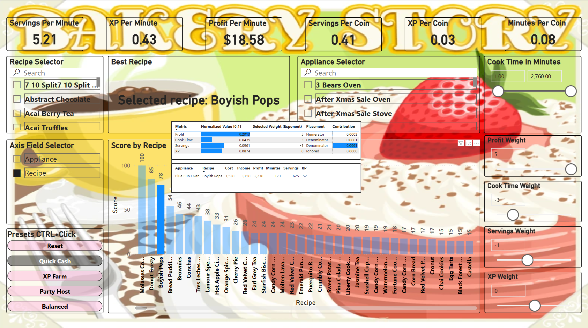

# 🍰 Bakery Story: Recipe Efficiency Report (Power BI)

A Power BI report that ranks *Bakery Story* recipes based on what *you* care about—Profit, Cook Time, Servings, and XP—using dynamic sliders and an exponent-based scoring model built on ratio-normalized metrics.

Whether you're chasing fast XP, quick cash, or low-maintenance bakes, the report adapts to your strategy in real time.

---

## What Is Bakery Story?

A mobile game where you run a virtual bakery—cooking, serving, earning coins, and leveling up. Each recipe varies in cook time, profit, XP, and servings. Appliances are limited, and customers arrive at a fixed rate.

So… which recipe is *best*?

---

## Why I Made This

This started as a debate between me and my partner, Stephanie. She liked big batches—fewer check-ins. I wanted faster returns.

> What if a report didn’t tell you the best recipe, but let *you* define it?

That’s exactly what this does.

---

## What This Report Does

A dynamic ranking tool that adapts to your priorities. Profit? Speed? XP? You decide—everything updates in real time.

**Key features:**
- Slider control over Profit, Cook Time, Servings, XP  
- Preset strategies like *Quick Cash*, *XP Farm*, *Balanced*  
- Appliance-level filters and cook-time limits  
- Instant score recalculations  
- Transparent scoring with tooltips and exported DAX

## How It Works (Under the Hood)

This isn’t just a slicer toy—it’s built on a tailored scoring model using:

- **Ratio-normalized metrics**, shifted +1 to ensure bounded outputs in the [1–2] range  
- **Exponentiation** to apply nonlinear influence based on user-assigned weights  
- **Dynamic DAX logic** that adapts to filters, slicers, and context-aware behavior

The result is a responsive, mathematically robust model that adjusts instantly to reflect your goals.

---

## Scoring Logic

Each recipe receives a dynamic efficiency score based on your weight settings:

1. Normalize each metric to a [1–2] range  
2. Raise each to its selected exponent (positive = favor; negative = penalize)  
3. Multiply the numerators, divide by the denominators  
4. Rank recipes by final score in current filter context

📄 See: [Measures Overview](./docs/measures_overview.md)  
📥 Download: [dax_measures.xlsx](https://raw.githubusercontent.com/Nicholas-BI/bakery-efficiency-score/main/docs/dax_measures.xlsx)

---

## Preset Strategies

| Strategy     | Profit | Cook Time | Servings | XP | Description                          |
|--------------|--------|-----------|----------|----|--------------------------------------|
| Quick Cash   | 20     | -20       | –5       | 1  | Maximize revenue, minimize wait time |
| XP Farm      | 5      | –20       | –5       | 20 | Level up quickly with short bakes    |
| Party Host   | 5      | –10       | 20       | 1  | Maximize servings for events         |
| Balanced     | 1      | –1        | -1       | 1  | A general-purpose optimization       |

---

## Data Model Overview

The report follows a clean star schema for efficient filtering and high-performance DAX:

**Fact Table**  
- `Fact_Bakery` — Recipe-level metrics and computed values

**Dimension Tables**  
- `Dim_Recipe` — Static recipe attributes  
- `Dim_Appliance` — Appliance types

**Disconnected Weight Tables**  
- `ProfitWeight`, `CookTimeWeight`, `ServingsWeight`, `XPWeight` — Used for slicers

**Helper Tables**  
- `Metrics`, `Axis Field Selector`, `Measure Table` — Support layout and interactivity

📄 See: [Data Model Description](./docs/data_model_description.md)

---

## Power Query & ETL

All transformations are handled in Power Query using a modular, transparent approach:

- Source → Base → Output  
- Explicit typing and descriptive step names  
- Designed for reusability and clarity

📄 See: [Power Query Overview](./docs/power_query.md)

---

## Report Design

- One-page interactive layout with slicers and filters  
- Tooltip overlays for full score transparency  
- Bookmark toggles for preset strategies  
- Theming and visuals inspired by the game’s design

📄 See: [Visuals Walkthrough](./docs/visuals_description.md)

---

## 📥 Try It Yourself

- 📥 [Download the Power BI report (.pbix)](https://raw.githubusercontent.com/Nicholas-BI/bakery-efficiency-score/main/docs/bakery_story.pbix)  
- 📥 [Download the DAX measures (.xlsx)](https://raw.githubusercontent.com/Nicholas-BI/bakery-efficiency-score/main/docs/dax_measures.xlsx)  
- 📥 [Download the source data (.xlsx)](https://raw.githubusercontent.com/Nicholas-BI/bakery-efficiency-score/main/docs/bakery_story_source.xlsx)

Open the `.pbix` file in [Power BI Desktop](https://powerbi.microsoft.com/desktop), adjust the sliders, and watch the rankings adapt.

---

## ▶️ Getting Started

1. **Clone the repository**  
   `git clone https://github.com/Nicholas-BI/bakery-efficiency-score.git`  
   *(Or download individual files using the links above)*

2. Open `bakery_story.pbix` in [Power BI Desktop](https://powerbi.microsoft.com/desktop)  
3. Adjust the sliders to reflect your strategy  
4. Explore the rankings, tooltips, and strategy bookmarks

---

## 📁 Repository Contents

- [`bakery_story.pbix`](./docs/bakery_story.pbix) — Main Power BI report  
- [`dax_measures.xlsx`](./docs/dax_measures.xlsx) — Full export of all DAX measures  
- [`bakery_story_source.xlsx`](./docs/bakery_story_source.xlsx) — Source data snapshot  
- [`measures_overview.md`](./docs/measures_overview.md) — Conceptual scoring breakdown  
- [`data_model_description.md`](./docs/data_model_description.md) — Schema and table logic  
- [`power_query.md`](./docs/power_query.md) — ETL transformation details  
- [`visuals_description.md`](./docs/visuals_description.md) — Report layout and interaction notes  
- [`LICENSE`](./LICENSE) — Creative Commons BY-NC 4.0

---

## Screenshots

| Ranked Recipes View                             | Control Panel (Sliders & Bookmarks)           |
|--------------------------------------------------|------------------------------------------------|
| *(Add image here if needed)*                     | *(Add image here if needed)*                  |

---

## Contributing

Have feedback or ideas for improvement?  
Feel free to open an issue or submit a pull request.

---

## License

Licensed under [Creative Commons BY-NC 4.0](./LICENSE)  
Free to use, modify, and share for non-commercial purposes with attribution.
