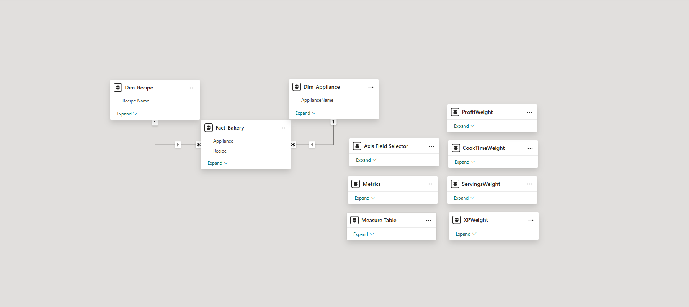

# Data Model Overview

This report uses a lean star schema—just one fact table, a few dimensions, and disconnected weight slicers—but it’s packed with interactive logic behind the scenes.

Curious how the scoring works or how sliders plug into DAX? You’re in the right spot.

📥 [Download the source data](https://raw.githubusercontent.com/Nicholas-BI/bakery-efficiency-score/main/docs/data/bakery_story_source.xlsx)  

---

## Fact Table

### `Fact_Bakery`
- One row per recipe  
- Core attributes:
  - `Income`, `Cost` → used to compute Profit  
  - `Cook Time` (in minutes)  
  - `Servings` per batch  
  - `XP` gained  
  - Recipe name and Appliance type  
- Drives all scoring and visual logic  

---

## Dimensions

### `Dim_Recipe`
- One row per recipe name  
- Supports slicers, titles, and filtering  

### `Dim_Appliance`
- Maps recipes to their appliance (e.g. oven, stove, fryer)  
- Used to filter by equipment availability  

---

## Weight Tables (What-If Sliders)

Created using `GENERATESERIES`, each weight table powers a disconnected slider for:

- `ProfitWeight`  
- `CookTimeWeight`  
- `ServingsWeight`  
- `XPWeight`  

**Weights range from –20 to 20**, controlling how much each metric influences the score:

- Positive → Favor (goes in numerator)  
- Negative → Penalize (goes in denominator)  
- Zero → Ignore the metric entirely  

Used with `SELECTEDVALUE()` to inject logic directly into DAX without affecting relationships.

---

## Utility Tables

These helper tables aren’t joined to the fact, but they drive interactive and dynamic logic:

### `Metrics`
- Lists each metric (Profit, Cook Time, Servings, XP)  
- Used in visuals and tooltips to loop through metric calculations  

### `Axis Selector`
- Provides display names for chart axes (e.g., “Recipe vs. Appliance”)  
- Powers dynamic axis swapping in ranking visual  

### `Measure Table`
- Organizational tool utilizing display folders to group measures

---

## Schema Diagram

Below is the full data model layout including fact, dimensions, and disconnected helpers:

---

### Explore Other Sections

- 📄 [`docs/measures_overview.md`](./measures_overview.md) – DAX logic  
- 📄 [`docs/power_query_overview.md`](./power_query_overview.md) – ETL design  
- 📄 [`docs/visuals_overview.md`](./visuals_overview.md) – Layout and interactions

---
