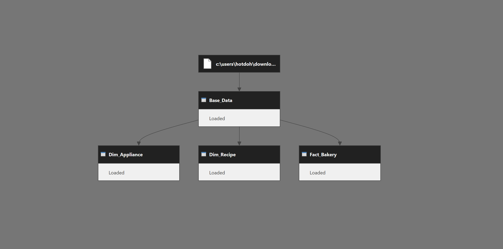

# Power Query Overview

This report's ETL (Extract, Transform, Load) process was built entirely in Power BI using Power Query (M). All transformations follow a modular, layered structure to ensure clarity, reusability, and maintainability.

[Click here to download the source data](https://raw.githubusercontent.com/Nicholas-BI/bakery-efficiency-score/main/docs/data/bakery_story.pbix)  

---

## Query Structure

The Power Query layer is organized into three tiers:

### Source and Base Queries

- `Base_BakeryData` — Raw recipe-level data loaded from the source `.xlsx` file. Columns are typed early, trimmed to essentials, and cleaned for consistency.

---

### Fact Table

- `Fact_Bakery` — Core metrics used in scoring and ranking, including cook time, servings, income, cost, XP, and calculated profit. Built from the cleaned base data.

---

### Dimension Tables

- `Dim_Recipe` — Static recipe attributes, such as name, category, and cook time.  
- `Dim_Appliance` — Appliance metadata used for filtering and axis switching.  
- `Metrics` — Helper table listing the four core scoring metrics.  
- `Axis Field Selector` — Enables toggling between different chart axes.  
- `Measure Table` — Used for dynamic measure selection in slicers or tooltips.

---

### Query Dependencies Diagram

The structure follows a Source → Staging → Output pattern. Here's the full dependency view:

---

## Design Principles

The Power Query transformations follow a consistent pattern:

- **Early Typing**: Date and numeric fields are typed at the source step to prevent type errors downstream.  
- **Clean Output Layer**: All data modeling columns are finalized in the `Fact_Bakery` output table, with no additional transformations needed in DAX.  
- **Descriptive Steps**: Each applied step is named clearly to support self-documenting code.  
- **Minimized Redundancy**: Shared logic appears only once, with no repeated calculations between tables.

---

## Available M Code

Full transformation logic is available in the following data:

- [`fact_bakery.txt`](./data/fact_bakery.txt)  
- [`dim_recipe.txt`](./data/dim_recipe.txt)  
- [`dim_appliance.txt`](./data/dim_appliance.txt)  

Each file contains the raw M code for its corresponding query.

---

### Explore Other Sections

- [`docs/data_model_overview.md`](./docs/data_model_overview.md) – Table relationships  
- [`docs/measures_overview.md`](./docs/measures_overview.md) – DAX logic  
- [`docs/power_query_overview.md`](./docs/power_query_overview.md) – ETL design  
- [`docs/visuals_overview.md`](./docs/visuals_overview.md) – Layout and interactions

---
